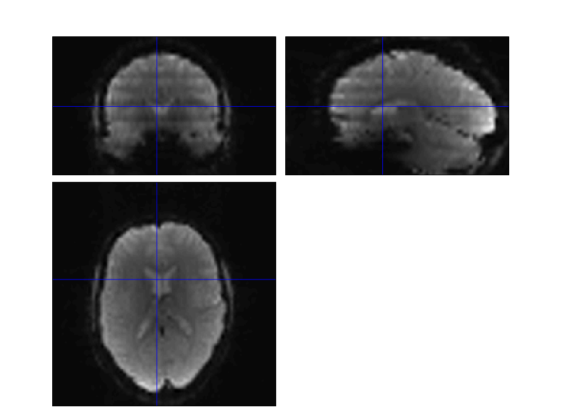

# Medical Imaging project

The small project focuses on processing some "functional magnetic resonance images", aka. fMRI, of some subjects. In particular, some of the images in these data set present some "stripe" artifacts and it is important to detect them.

## Artifact detection in functional MRI

This project focuses on the detection of individual volumes, in a series of functional MR images, presenting some specific "stripe" artifacts. There are only a few problematic volumes but it is important to list them before further processing such data!

### MR imaging and functional MRI:

"Magnetic resonance imaging", MRI for short, technique will be covered later on in this course. For a nice prelude, read the [Wikipedia on MRI](https://en.wikipedia.org/wiki/Magnetic_resonance_imaging). MRI data come in many flavours and here we focus on "functional MRI", fMRI for short, which are typically used to figure out which part of the brain is activated while the subject being scanned performs some mental task. Here is the [Wiki page on fMRI](https://en.wikipedia.org/wiki/Functional_magnetic_resonance_imaging) for a nice description.

fMRI data consists of a series of whole brain 3D images, acquired about every 2 seconds (exact value depends on scanner and acquisition). The signal measured is sensitive to the oxygen level in the blood, hence the name "[BOLD signal](https://en.wikipedia.org/wiki/Blood-oxygen-level-dependent_imaging)", and is a proxy to the underlying neuronal activity: when neurons activate, they need energy and oxygen; the latter is brought to the area through capillaries and therefore the BOLD signal fluctuates with the neuronal activity. The exact way data are acquired and should be processed to map brain activation is not relevant for this home work but...

Real fMRI data suffer from various defects, due to hardware, the acquisition sequence, or the subject. In the data to process here, some volumes in the series show some specific artifactsl: some slices in these volumes are darker or brighter than the adjacent ones. The problem is thus to find those few problematic within series of a few 100's volumes. Eye  balling the data is clearly to subjective and time consuming, therefore some automatic detection!

### Data

The data are available on ULiege's One Drive in [this folder](https://mseduculiegebe-my.sharepoint.com/:f:/g/personal/c_nameofprofessortomakeitvalid_uliege_be/Eqic--REoTZEo341GqJhlgoB8jMeJMcH5H3Vze1_1B5ozw). There are 15 sets of data with, each with the fMRI data from an acquisition session, split into 3 categories:

- ``artif_0*_bold.nii`` are data in which some "bad" volumes are clearly visible:
- ``medium_0*_bold.nii`` are data where there are no obviously "bad" volumes but they are still of rather high noise;
- ``clean_0*_bold.nii`` are data which should be clean and artifactless.

Those 3 sets of images are the raw images, as they were converted from the original DICOM format on the scanner into NIfTI format for reasearch applications.

Here is a example of clearly artefacted volume:

## Overall instructions

The aim is thus to automatically detect the problematic volumes in the ``artif_0*_bold.nii`` data, then make sure does not pick up anything (or very few volumes) in ``clean_0*_bold.nii``. The ``medium_0*_bold.nii`` data could then be used to investigate the detection sensitivity-to-specificity ratio.

### Goals

_**The goal of your work is thus to automatize the detection of "bad" volumes in a series of fMR images.**_

This is an "open end" problem, the points are

- to find a solution that works
- characterize and assess the quality of the solution

Such artifact detection in a time series of 3D images could proceed in 2 steps

- first, find a measure of the image quality and/or level of noise/artifact
- second, pick the outlier volumes in the series

To detect those stripy patterns, any signal processing technique: filtering, outlier detection, machine learning,... And since we should all be using open data format, results should be written out in a [.csv](https://en.wikipedia.org/wiki/Comma-separated_values)/[.tsv](https://en.wikipedia.org/wiki/Tab-separated_values) file, for tabular results, or in a [.json](https://en.wikipedia.org/wiki/JSON) file for key-value structured results.

#### NIfTI images

To quickly visualize NIfTI images, with a "double-click the file", one can rely on software like

- [MRIcron](https://www.nitrc.org/projects/mricron) for Windows, 
- [Mango](http://ric.uthscsa.edu/mango/) for Mac-OS ,
- [ITK-snalp](http://www.itksnap.org/pmwiki/pmwiki.php) for Linux and other OS's.

The images are all in the [NIfTI format](https://nifti.nimh.nih.gov/). There are plenty of existing routines for reading/writing these images:

- for C-code, [https://nifti.nimh.nih.gov/pub/dist/src/](https://nifti.nimh.nih.gov/pub/dist/src/)
- for Matlab, in SPM12 or [https://goo.gl/BzK9Vf](https://goo.gl/BzK9Vf)
- for Python, [http://nipype.readthedocs.io/en/0.12.0/](http://nipype.readthedocs.io/en/0.12.0/) or [http://niftilib.sourceforge.net/pynifti/](http://niftilib.sourceforge.net/pynifti/)

